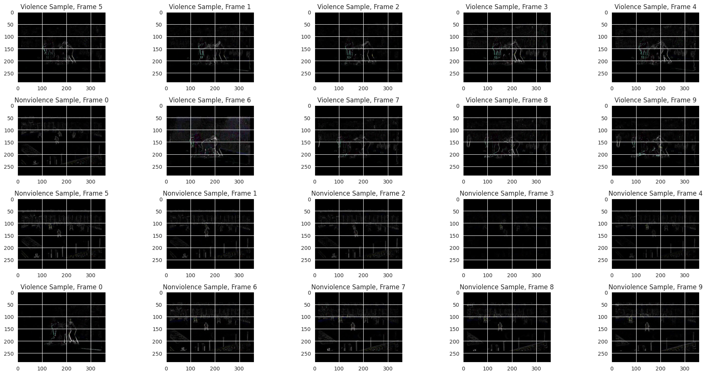

# LSTM Forecasting and Violence Detection

Two projects built on temporal data. One predicts cryptocurrency prices from a
30-day window with recurrent models; the other classifies short video clips as
violent or not using per-frame CNN features and a convolutional LSTM.



## Requirements

Python 3.10 or later. Both projects need their own data: a daily price series per
coin, and a labelled video clip dataset. A GPU is recommended for the video
model.

## Installation

```bash
pip install -e .
```

With the test suite:

```bash
pip install -e ".[dev]"
```

## Usage

Forecast prices:

```python
from forecasting import build_hybrid_model, errors, split

windows = split(prices, window=30, horizon=1)
model = build_hybrid_model()
model.fit(windows.x_train, windows.y_train, epochs=50, batch_size=32)

predicted = windows.scaler.inverse_transform(model.predict(windows.x_test))
actual = windows.scaler.inverse_transform(windows.y_test)
print(errors(actual, predicted).format())
```

Build and score the video classifier:

```python
from violence_detection import build_model, from_predictions

model = build_model(frames=20)
model.fit(train_clips, train_labels, epochs=20)
print(from_predictions(test_labels, model.predict(test_clips)).format())
```

## Results

### Price forecasting

A hybrid model with parallel LSTM and GRU branches over the same 30-day window,
concatenated before the output, measured against a single-LSTM baseline on two
coins at three forecast horizons. RMSE in each coin's own price units, lower is
better.

| coin | horizon | hybrid | LSTM baseline |
| --- | --- | --- | --- |
| Litecoin | short | 8.52 | 9.07 |
| Litecoin | medium | 12.12 | 12.02 |
| Litecoin | long | 16.28 | 16.00 |
| Monero | short | 11.10 | 12.74 |
| Monero | medium | 14.63 | 15.40 |
| Monero | long | 19.84 | 20.34 |

The hybrid wins four of six, and the pattern matters more than the count. Its
clearest margin is at the shortest horizon on both coins, 6% better RMSE on
Litecoin and 13% on Monero. By the longest horizon the Monero advantage narrows
to 2.5% and the Litecoin one has reversed. The extra branch helps where there is
short-range structure to exploit and stops helping once the horizon is long
enough that little remains to find. MAPE sits between 6% and 9% throughout.

### Violence detection

ResNet50 is applied per frame through `TimeDistributed`, producing a sequence of
spatial feature maps, and a `ConvLSTM2D` reads that sequence while preserving the
spatial layout, so motion between frames stays localised rather than being
flattened before the temporal model sees it.

Test set of 150 clips, confusion matrix `[[72, 3], [5, 70]]`:

| metric | value |
| --- | --- |
| accuracy | 94.7% |
| precision | 95.9% |
| recall | 93.3% |
| F1 | 94.6% |

Every figure follows from the counts. `violence_detection.metrics` sums true and
false positives across the whole split before taking any ratio, because
precision, recall and F1 are ratios of counts and a mean of per-batch ratios is a
different quantity. A test demonstrates the gap on a four-sample example where
batch-averaged precision gives 0.75 and accumulated precision gives 0.67.

## Data handling

`forecasting.split` cuts the series at a point in time: everything before trains,
everything after tests, and the scaler is fitted on the training section only.
Both matter on a time series. A random split draws training windows from after
test windows and asks the model to predict a past it has already seen, and a
scaler fitted on the full series carries the test period's range into training
features. Tests assert both properties directly.

The forecasting head is linear rather than rectified, since a head that cannot go
below zero has no gradient with which to correct an under-prediction.

## Project structure

```
forecasting/
    data.py       windowing and chronological splitting
    models.py     hybrid LSTM and GRU model, and the LSTM baseline
    metrics.py    MSE, RMSE, MAE, MAPE
violence_detection/
    model.py      ResNet50 per frame, ConvLSTM over time
    metrics.py    counts accumulated over a split, then the ratio
tests/            leakage, metric correctness and model wiring
docs/             figures referenced by this README
pyproject.toml    dependencies
```

## Components

| module | responsibility |
| --- | --- |
| `forecasting.data` | Builds supervised windows and the chronological split |
| `forecasting.models` | Builds and compiles both forecasting architectures |
| `forecasting.metrics` | Error measures in the series' own price units |
| `violence_detection.model` | Builds the frame encoder and temporal head |
| `violence_detection.metrics` | Confusion counts and the metrics derived from them |

## Testing

```bash
python -m pytest tests/
```

Twenty-two tests covering window construction, split chronology, scaler
containment, every error measure, metric accumulation, and model output shapes.
Models are built without pretrained weights, so nothing is downloaded.
